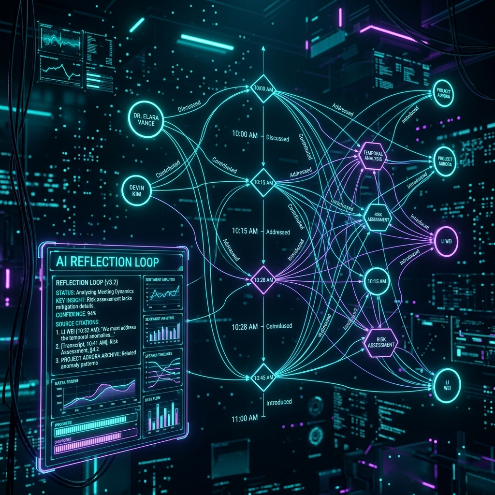

# IQMeetRAGv2 - Agentic Temporal GraphRAG


A production-grade Agentic Temporal GraphRAG system designed for complex meeting intelligence. Built for AI engineers and businesses needing to extract accurate relationships, timelines, and insights from meeting transcripts. Achieves <1s latency with hybrid search and Reciprocal Rank Fusion (RRF) while supporting multi-provider LLMs.



## Key Features

- **Extract entities and temporal relationships automatically** from transcripts using LangChain and Neo4j, enabling deep contextual understanding of meetings.
- **Rerank hybrid search results dynamically** with a custom `TemporalRerankPostprocessor` combining semantic, recency, and validity scores for maximum relevance.
- **Answer complex queries intelligently** via Router-Fusion-Rerank agentic reflection loops that auto-correct low-confidence answers.
- **Support multiple LLM providers seamlessly** out-of-the-box using LiteLLM, including Google Gemini, VertexAI, and Ollama for local deployments.
- **Scale vector indexing effortlessly** using Qdrant for chunk-level semantic retrieval across thousands of meeting hours.
- **Validate temporal overlaps and schemas robustly** using Pydantic v2 and custom `EventValidatorChain` to guarantee timeline accuracy.

## Quick Start

Get the system up and running with a single command to index your first meeting transcript.

**1. Install and configure**
```bash
pip install -e .
export OPENAI_API_KEY="your-key"
export NEO4J_URI="bolt://localhost:7687"
export QDRANT_URL="http://localhost:6333"
```

**2. Run the agent**
```python
from iqmeet.agent import AgenticQueryWorkflow
workflow = AgenticQueryWorkflow()
result = workflow.query("What were the key action items from the Q3 planning meeting?")
print(result)
```

**Expected Output:**
```json
{
  "answer": "The key action items were: 1. John to finalize the budget by Friday. 2. Sarah to initiate the marketing campaign next week.",
  "confidence": 0.95,
  "sources": ["doc_q3_planning_chunk_12"]
}
```
*The agent successfully routed the query to the event and graph retrievers, fused the results, and generated a highly confident answer.*

## Installation

### Method 1: Using pip (Standard)
```bash
git clone https://github.com/your-org/IQMeetRAGv2.git
cd IQMeetRAGv2
pip install -r requirements.txt
pip install -e .
```

### Method 2: Using Docker (Recommended for Production)
```bash
docker-compose up -d --build
```
This spins up the FastAPI backend, Neo4j, and Qdrant automatically.

### Method 3: Using Poetry / UV (For Developers)
```bash
uv pip install -e .
```

## Usage Examples

### 1. Basic Semantic Query
Solve simple factual lookups using the vector database.
```python
from iqmeet.retriever import HybridRetriever

retriever = HybridRetriever()
context = retriever.get_context("Who attended the engineering sync?")
print(context)
```
*Explanation: This bypasses the graph and uses pure vector similarity for fast, simple lookups.*

### 2. Temporal Graph Extraction
Extract a timeline of events from raw text.
```python
from iqmeet.extraction import LLMGraphTransformer
from iqmeet.validation import EventValidatorChain

text = "Yesterday we decided to launch. Today we are testing. Tomorrow we deploy."
graph_data = LLMGraphTransformer().extract(text)
validated_events = EventValidatorChain().validate(graph_data)
print(validated_events)
```
*Explanation: The LLM converts text into nodes/edges, and the validator ensures temporal logic holds true (Yesterday < Today < Tomorrow).*

### 3. Full Agentic Reflection Loop
Ask a complex question requiring reasoning across multiple meetings.
```python
from iqmeet.agent import AgenticQueryWorkflow

workflow = AgenticQueryWorkflow(max_retries=3)
response = workflow.run_loop("Did the marketing team agree with the engineering timeline proposed last month?")
print(response["reasoning_steps"])
```
*Explanation: The agent queries the graph, realizes it lacks the marketing context, refines its search query, pulls vector data, and synthesizes a final verified answer.*

### 4. Multi-Provider LLM Setup
Switch from OpenAI to local Ollama for privacy.
```python
from iqmeet.config import Settings
import os

os.environ["LITELLM_MODEL"] = "ollama/llama3"
# The system now uses local Llama3 without code changes
```
*Explanation: LiteLLM abstracts the provider, allowing you to seamlessly swap out APIs for local models.*

## Troubleshooting

**Error: Neo4j Connection Refused**
* **Cause**: Neo4j container is not running or credentials are wrong.
* **Fix**: Run `docker ps` to ensure Neo4j is up. Check `NEO4J_USERNAME` and `NEO4J_PASSWORD` in your `.env`.

**Error: Qdrant Timeout during Indexing**
* **Cause**: Payload too large for the local Qdrant instance.
* **Fix**: Decrease the `chunk_size` in your `RecursiveCharacterTextSplitter` configuration or increase the timeout in the Qdrant client.

**Error: Agent stuck in an infinite loop**
* **Cause**: The LLM is failing to reach the confidence threshold.
* **Fix**: Ensure `max_retries` is set to a reasonable limit (e.g., 3) in the `AgenticQueryWorkflow`.

## Documentation Links

### 🏗️ [Architecture Blueprint](./ARCHITECTURE_PRODUCTION.md)
Dive deep into the production-grade design of the Agentic Temporal GraphRAG system. This blueprint reveals how LangChain, Neo4j, and Qdrant are orchestrated to extract complex temporal relationships from meeting transcripts. Discover our low-latency hybrid search mechanisms and the exact data flows powering our Router-Fusion-Rerank reflection loops.

### 🏃 [Implementation Sprints](./IMPLEMENTATION_PLAN_SPRINTS.md)
Follow the step-by-step agile evolution of this complex meeting intelligence system. This document outlines our sprint-based approach to building the custom `TemporalRerankPostprocessor` and Pydantic validation chains. It provides a transparent look at how we tackled scaling challenges and optimized chunk-level semantic retrieval.

### 🔌 [Advanced LiteLLM Config](https://docs.litellm.ai)
Unlock the full multi-provider potential of the system with this external configuration guide. Learn how LiteLLM abstracts the underlying APIs, allowing seamless hot-swapping between OpenAI, Google Gemini, VertexAI, and local Ollama models. Explore advanced settings to manage rate limits, routing, and cost optimization effectively.

### 🕸️ [Neo4j Graph Schema Details](./docs/schema.md)
Explore the highly optimized data structures that form the temporal backbone of our GraphRAG. This guide details the node and edge definitions required to accurately map chronological events and action items. Understand how our LLMGraphTransformer schema guarantees temporal validity (e.g., Yesterday < Today < Tomorrow) during complex query resolutions.

## Contributing

We welcome contributions from the community! To get started:
1. Fork the repository and create your feature branch (`git checkout -b feature/amazing-feature`).
2. Run the test suite: `pytest tests/`
3. Commit your changes (`git commit -m 'Add some amazing feature'`).
4. Push to the branch and open a Pull Request.

Please ensure you adhere to our code of conduct and write tests for new temporal validation logic.

## License

Distributed under the MIT License. See `LICENSE` for more information.

## Credits

Special thanks to the LangChain community for the `langchain-qdrant` and `langchain-community` integrations, making this graph-vector hybrid architecture possible.
